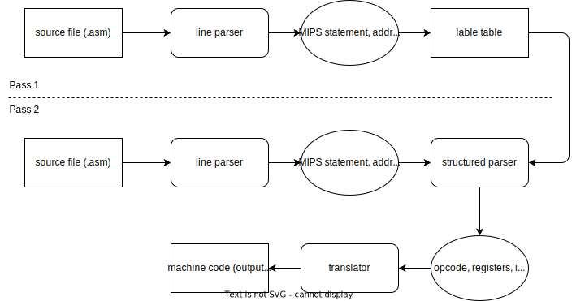

# Report

## Run

To run the code, please refer to instructions in [`source/README.md`](source/README.md).

## MIPS Assembler

In principle, the MIPS assembler is simply a translator from MIPS assembly code to binary instruction by following a set of rules called MIPS instruction set.

To translate each assembly statement, one just need to parse the statement and obtain the instruction, registers, immediates, and labels.

For example, `bne $t7, $zero, fibonacciExit` should be parsed into

```
instruction : bne
rs          : $t7
rt          : $zero
label       : fibonacciExit
```

After obtaining such structured instructions, one can follow the binary code format of MIPS and easily translate them into machine code.

For the example above, assuming address of `fibonacciExit` is 0x40001C and the address of the current instruction is 0x400000, then by looking up the `bne` code format, the machine code is

```
000101 01111 00000 0000000000000110
bne   |  rs |  rt | (0x40001C-0x400000-4) >> 2
```

The missing piece in the above procedure is how to obtain the address of the labels.
This can be done by a two-pass parsing.
In the first pass, the addresses of labels should be registered for second pass.

## High-level Implementation Ideas

There are 4 main modules, which are line parser (parse the whole .asm file into lines of instructions), label table (store the address of each label), structured parser (parse a single MIPS statement into structured output), and translator (translate the structured output into binary machine code).

An overview of the workflow is as follows:



## Implementation Detail

### Line Parser

This is a simple parser that identify `.text` segment, remove comments, unnecessary spaces and tabs, and count the address of the current MIPS statement.

### Lable Table

Lable table is a hash table (implemented as `unordered_map` in my C++ code).
The key is label, and the value is the address.

### Structured Parser

The structured parser looks up the format of a MIPS statement and tries to parse the statement according to the format.

For simplicity, the format of all supported MIPS statement is stored in `instructions.json` (generated with Python).
The structured parser loads the json file using library `json.hpp` (included in source code) and tries to match the format with `regex` (C++ regular expression library).

### Translator

A simple translation from opcode, register numbers, immediates, etc. to machine code.