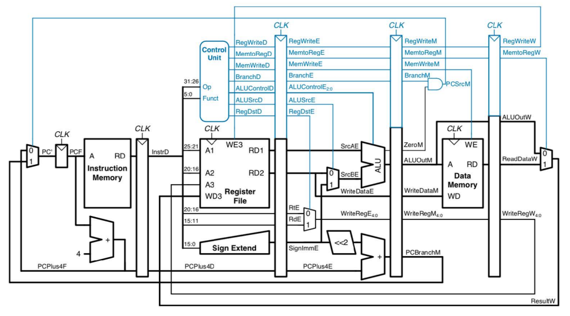

# ALU and CPU Pipeline

**ALL hazards are handled.**

To run the code, see [README](./src/README.md).

## The Big Picture of the Pipeline

A 5-stage pipelined CPU is a type of processor architecture where the execution of instructions is divided into five stages: fetch, decode, execute, memory access, and write-back. In each stage, a specific task is performed on the instruction being executed, and the instruction is then passed to the next stage for further processing.

The pipelined CPU architecture improves the performance of the processor by allowing multiple instructions to be in different stages of execution at the same time. This means that while one instruction is being executed, another instruction can be fetched and decoded, which leads to an increase in the number of instructions that can be executed per clock cycle.

However, pipelining introduces hazards such as data hazards, control hazards, and structural hazards that can affect the performance of the processor. These hazards can lead to pipeline stalls, which can reduce the benefits of pipelining.

To mitigate these hazards, techniques such as forwarding and branch prediction can be used. Forwarding involves passing data between stages to avoid data hazards, while branch prediction is used to minimize the impact of control hazards by predicting the outcome of branch instructions.

Overall, the 5-stage pipelined CPU architecture is a widely used processor architecture that balances performance and complexity.

## The Pipeline

The original pipeline that can only support add, sub, and, or, nor, xor, slt, lw, sw, beq instructions.

Relatively simple components can be added to support shift instructions and bne.
However, it needs significant effort to support jump instructions (`j`, `jr`, `jal`).

The added circuits to handle jumps:

Note that the position of some components are changed for easier hazard detection.

## High Level Implementation Ideas

To implement a 5-stage pipelined CPU, the problem can be broken down into five stages: fetch, decode, execute, memory access, and write-back. Each stage can be implemented as a separate module, which can be integrated to form a pipeline that processes instructions in parallel. Additional modules may be required to handle pipeline hazards and control flow instructions. The pipeline can be controlled using a clock signal, with each stage completing its operation on one instruction and passing it on to the next stage.

## Implementation Details

### Clocked Components

In the pipeline, register file and data memory are clocked, which makes ID and MEM stage have two clocked components (including stage registers).
Since data signals (when read) need to pass through two clocked components within one clock cycle, the read (from register file or data memory) cannot happen at the clock rising edge.
In my implementation, the read is combinatorical (essentially equivalent to a large multiplexer). Although this is not practical for large data memory for real-world CPU, it is fine with this toy CPU which has 512 words data memory.

To handle register file simultaneous read and write hazard, the write is implemented to happen at the clock falling edge so that the write is completed before the read (the next rising edge).

### Hazard

For simplicity, I only implemented stall to handle all hazards. Forwarding is possible but just too much effort for me to do it.

For branch-related hazard, a stall count is maintained so that the correct next instruction can be fetched.

For other data hazard, the stall detection unit will detect hazard with the next statement in IF stage, the WriteReg and RegWrite in ID and EX stages (because instructions in MEM stage and afterward cause no hazard).

When a stall is signaled, the PC will be kept unchanged (by -4) and a NOP instruction will be issued into the ID stage.

### End Instruction

The last instruction is always `0xffffffff`. When CPU encounters this in the ID stage, it will signal stall and set the stall count to 3 so that all previous instructions can be completed.
