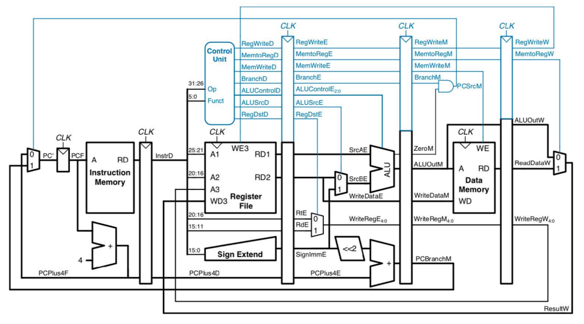

# A Toy 5-stage Pipeline CPU

## Compile and Run

To compile: go to `src` and then `make compile`.

To run with a given MIPS binary machine code file `CPU_instruction.bin`: `vvp CPU`.

`CPU` executable will load instructions from `CPU_instruction.bin` and start execution.

### Debug Option

By default, nothing will be printed to terminal. Only the final data memory will be written to `data.bin`.
For debugging, you can set `debug` option by defining macro `DEBUG` in your `config.v`. Then every top-level variables and control signals will be printed step by step.

Example:

```bash
# enable debugging in config.v and then
make test
```

```
iverilog -o CPU cpu.v test_cpu.v control.v alu_module.v utils.v hazard.v;
vvp CPU;
WARNING: utils.v:118: $readmemb(CPU_instruction.bin): Not enough words in the file for the requested range [0:99].
00100000000010010000000000001100
00100000000010101111111111111110
00100000000010110000000000010111
00100000000000100000000000000000
...
xxxxxxxxxxxxxxxxxxxxxxxxxxxxxxxx
** VVP Stop(0) **
** Flushing output streams.
** Current simulation time is 10000 ticks.
> cont
** Continue **
status:
Stall: x
StallCount:          0
StallOut: 0
StallCountOut:          0
Is end: 0
==============IF stage==============
PC:          4
PCF:          0
InstrF: 00100000000010010000000000001100
PCPlus4F:          4
==============ID stage==============
InstrD: xxxxxxxxxxxxxxxxxxxxxxxxxxxxxxxx
PCPlus4D:          x
RegA1:  x
RegA2:  x
RegA3:  x
RegRD1D:          x
RegRD1OutD:          x
RegRD2D:          x
PCJumpRegD:          x
PCJumpLabelD:          X
SignImmExtD:          x
UnsignImmExtD:          X
SAImmExtD:          X
ImmD:          x
PCBranchAddr:          x
RtD:  x
RdD:  x
WriteRegDPrior:  x
WriteRegD:  x
--> control:
ALUControlD: 1111
RegWriteD: x
MemtoRegD: x
MemWriteD: x
BranchD: x
BranchEqualD: x
ALUSrcD: x
RegDstD: x
ImmExtSrcD: x
ImmSrcD: x
ALUShiftSrcAD: x
ALUShiftSrcBD: x
JumpD: x
JumpRegD: x
RegRD1OutSrcD: x
RegDstJalD: x
==============EX stage==============
SrcAE:          x
SrcBE:          x
SrcBEPrior:          x
SignImmE:          x
WriteDataE:          x
PCPlus4E:          x
RegRD1E:          x
RegRD2E:          x
ALUOutE:          0
PCBranchE:          x
WriteRegE:  x
ALUFlagE: 000
--> control:
ALUControlE: xxxx
RegWriteE: x
MemtoRegE: x
MemWriteE: x
BranchE: x
BranchEqualE: x
ALUSrcE: x
ALUShiftSrcAE: x
ALUShiftSrcBE: x
==============MEM stage==============
ZeroM: x
ALUOutM:          x
WriteDataM:          x
PCBranchM:          x
WriteRegM:  x
ReadDataM:          x
--> control:
RegWriteM: x
MemtoRegM: x
MemWriteM: x
BranchM: x
BranchEqualM: x
PCSrcBranchM: x
==============WB stage==============
ALUOutW:          x
ReadDataW:          x
WriteRegW:  x
ResultW:          x
--> control:
RegWriteW: x
MemtoRegW: x
==============Special==============
PCSrc: x
registers:
0:      00000000        00000000        00000000        00000000        00000000        00000000        00000000        00000000
...
24:     00000000        00000000        00000000        00000000        00000000        00000000        00000000        00000000
data memory:
0:      00000000        00000000        00000000        00000000        00000000        00000000        00000000        00000000
...
288:    00000000        00000000        00000000        00000000        00000000        00000000        00000000        00000000
** VVP Stop(0) **
** Flushing output streams.
** Current simulation time is 30000 ticks.
```

## The Pipeline

The original pipeline that can only support add, sub, and, or, nor, xor, slt, lw, sw, beq instructions.



Relatively simple components can be added to support shift instructions and bne.
However, it needs significant effort to support jump instructions (`j`, `jr`, `jal`).

The added circuits to handle jumps:



Note that the position of some components are changed for easier hazard detection.

### Clocked Components

In the pipeline, register file and data memory are clocked, which makes ID and MEM stage have two clocked components (including stage registers).
Since data signals (when read) need to pass through two clocked components within one clock cycle, the read (from register file or data memory) cannot happen at the clock rising edge.
In my implementation, the read is combinatorical (essentially equivalent to a large multiplexer). Although this is not practical for large data memory for real-world CPU, it is fine with this toy CPU which has 512 words data memory.

To handle register file simultaneous read and write hazard, the write is implemented to happen at the clock falling edge so that the write is completed before the read (the next rising edge).

## Hazard

For simplicity, I only implemented stall to handle all hazards. Forwarding is possible but just too much effort for me to do it.

For branch-related hazard, a stall count is maintained so that the correct next instruction can be fetched.

For other data hazard, the stall detection unit will detect hazard with the next statement in IF stage, the WriteReg and RegWrite in ID and EX stages (because instructions in MEM stage and afterward cause no hazard).

When a stall is signaled, the PC will be kept unchanged (by -4) and a NOP instruction will be issued into the ID stage.

### End Instruction

The last instruction is always `0xffffffff`. When CPU encounters this in the ID stage, it will signal stall and set the stall count to 3 so that all previous instructions can be completed.
