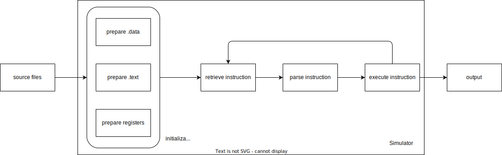

# MIPS Simulator Design

## The Big Picture

A MIPS program can be executed in two stages, i.e. data setup and code execution.

### Data Setup

To run a MIPS program, the memory needs to be properly setup before actually running the progrm. In short, `.text`, `.data` (static data part), and registers need to be setup.

For `.text`, the assembled binary code of MIPS instructions are stored in successive order starting from address `0x400000`.

For `.data`, put the static data defined in `.data` into successive memory starting from `0x10000000` (i.e. the end of `.text` memory. In simulation, this is `0x500000`). Do mind the alignment issue.

For registers, set PC register to the starting address of `.text` (i.e. `0x400000`), set `$sp` to the starting address of stack (i.e. `0x7fffffff` and `0xa00000` in simulation), set `$fp` to `$sp`, set `$gp` to `0x1000000+32KB` (starting address of `.data` plus a 32KB offset. In the simulation, it is `0x500000+32KB`) to facilitate fast memory access to data in the range `.data~.data+64KB` for `lw` and `sw`.

### Code Execution

MIPS code is executed through machine cycles. Here is a brief view of the machine cycle:

1. retrieve the MIPS code whose address is the value of the PC register

2. increment PC register value by 4 (so it points to the next instruction)

3. execute the retrieved MIPS code 

## Overall Design



The simulator is implemented as a C++ class `Simulator`. During initialization, the `.text`, `.data`, and registers' contents are properly setup.

In the machine cycle, the most important component is a parser that parse a assembled MIPS code into some intermediate representation that can be readily executed. 

Generally, most MIPS instructions take two input arguments (or less) and output a value to be stored somewhere in registers or memory. Therefore, whenever possible (some instructions like `beq` that takes more than 2 arguments), the parser parse the MIPS code into information about where to load the input arguments,  where to store the output, what operation should be done for the 2 arguments. Then input arguments are retrieved with the parsed result, output generated with the desired operation, and output is stored at the specified location.

## Implementation Details

The parser is the most important part of the simulator. The parser receives assembled MIPS binary code and generates parsing results defined as

```cpp
enum class location {
    REGISTER, MEMORY, IMM, UNK // UNK for not writing
};

struct value_struct {
    int reg = -1;
    int base = -1;
    int offset = -1;
    int imm;
    int size = -1; // for save instruction
    location type;
};

struct op_struct {
    value_struct in1 {.type = location::UNK}, 
                 in2 {.type = location::UNK}, 
                 out {.type = location::UNK};
    int (*op_func)(int, int, int&, Memory&);
};
```

The `op_func` expects two input argument, a reference to PC (for branch and jump), and a reference to `Memory` (for `lw, lh, lb`).

Most instructions can be handled in the above way. However, a handful of MIPS statements need special attention.

1. `syscall`

2. `div` (involve `HI, LO` registers)

3. `divu` (involve `HI, LO` registers)

4. `mult` (involve `HI, LO` registers)

5. `multu` (involve `HI, LO` registers)

6. `bltz` (need to check `rt`)

7. `bgez` (need to check `rt`)

8. `beq` (need `rs, rt, imm` as input)

9. `bne`(need `rs, rt, imm` as input)

10. `lwl` (need `rs, rt, imm` as input)

11. `lwr` (need `rs, rt, imm` as input)

12. `swl` (need `rs, rt, imm` as input)

13. `swr` (need `rs, rt, imm` as input)

The above listed instructions need to be handled with their own logic.
